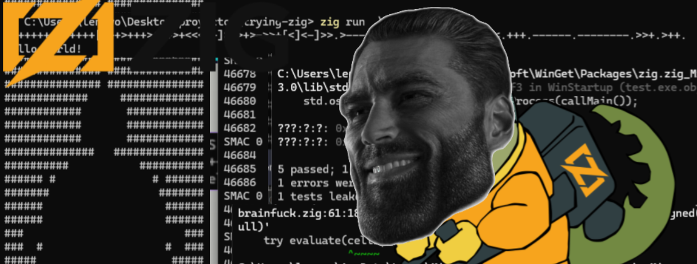

# trying zig
hello i have been trying zig for a few days now.
i have been wanting to use it for developing some games with raylib because it seems to be easier to port and to adapt for multiple operative systems(i also hate using the c/c++ toolchain of windows).

these are just little programs that i made in zig just to try to understand it.

obviously the program will be unorganized because, i will not come back and change anything, now its time to actually build some real shit  